# How to connect Apache Kafka with the Internet Computer in less that 5 minutes

This example shows how to connect [Apache Kafka](https://kafka.apache.org/) with [Internet Computer](https://internetcomputer.org/) smart contracts using [Apache Camel](https://camel.apache.org/), the [Apache Karavan](https://github.com/apache/camel-karavan) Visual Studio Code plugin, and the IC4J Camel component.

_The Internet Computer (ICP) is a set of protocols that allow independent data centers around the world to band together and offer a decentralized alternative to the current centralized internet cloud providers._

_Apache Camel is an open source integration framework designed to make integrating systems simple and easy. It allows end users to integrate various systems using the same API, providing support for multiple protocols and data types, while being extensible and allowing the introduction of custom protocols._

The IC4J Camel component allows native execution of Internet Computer smart contracts from Apache Camel.

This version assumes the simpler Hello World canister flow from the original article.

We assume Apache Kafka is already installed and running, that the topic `myTopic` already exists, and that the Internet Computer SDK is installed locally.

## Hello World Canister

The example canister exposes a `greet` method that returns `Hello, <name>!`.

```motoko
actor {
  public func greet(name : Text) : async Text {
    return "Hello, " # name # "!";
  };
};
```

To deploy this smart contract and create a new canister, use the Internet Computer `dfx` tool.

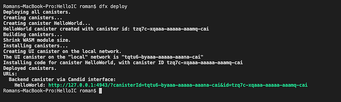

## Camel Route

The flow uses a single Kafka topic consumer and calls the canister method `greet` with the incoming message body.

```yaml
- route:
    id: route-12df
    from:
      uri: kafka:myTopic
      id: from-001e
      parameters:
        brokers: localhost:9092
      steps:
        - log:
            message: ${body}
        - to:
            uri: ic:update
            id: to-ce39
            parameters:
              canisterId: <HELLO_WORLD_CANISTER_ID>
              method: greet
              url: http://127.0.0.1:4943
              fetchRootKey: true
        - log:
            message: ${body}
```

In this flow, sending the message `world` to Kafka returns `Hello, world!` from the canister.

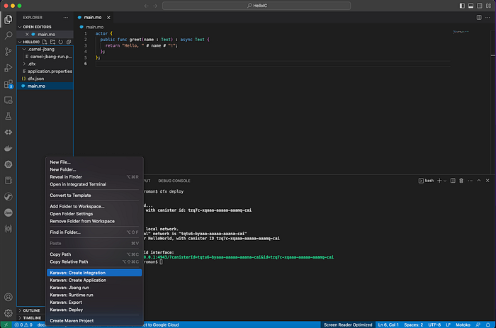

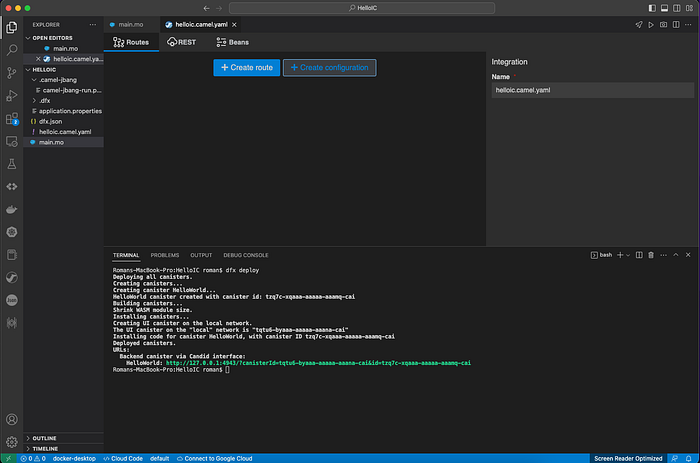

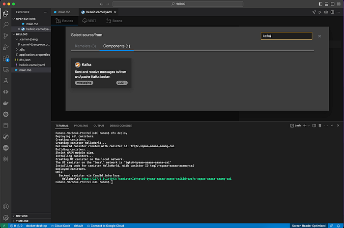

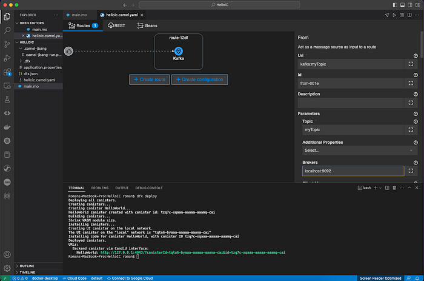

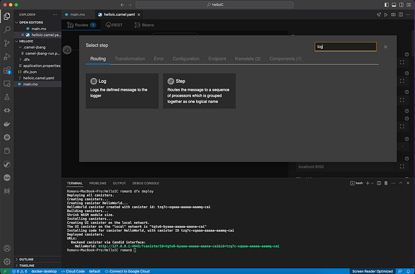

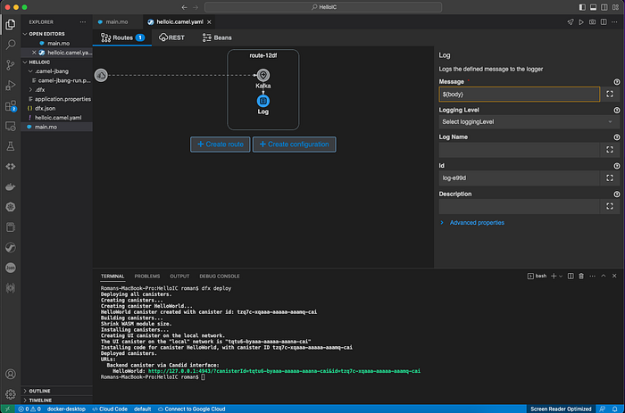

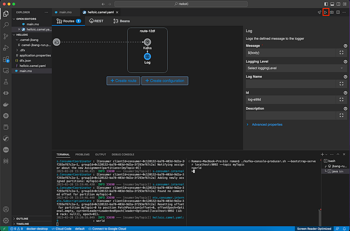

## Local Replica Configuration

For a local ICP replica, configure the component with the local replica URL and enable root key fetching:

```properties
ic.location=http://127.0.0.1:4943/
ic.canister=<LOCAL_CANISTER_ID>
ic.fetchRootKey=true
```

The `fetchRootKey` setting is required for local replica calls and is passed directly to the Camel `ic` endpoint.

If you are configuring the component in Karavan, this corresponds to enabling the **Fetch Root Key** option.

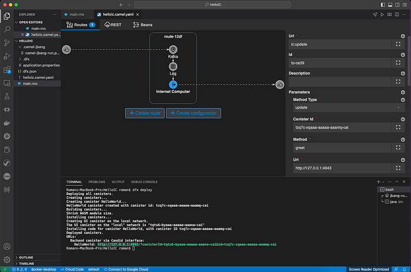

## Running the Hello World Example

Make sure Kafka is running on `localhost:9092`, create topic `myTopic`, deploy the Hello World canister, and then start the Camel integration.

```sh
bin/kafka-topics.sh --bootstrap-server=localhost:9092 --create --topic myTopic --partitions 1 --replication-factor 1 --if-not-exists
```

When the integration runs successfully, it logs the input body first and then the canister result, for example `Hello, world!`.

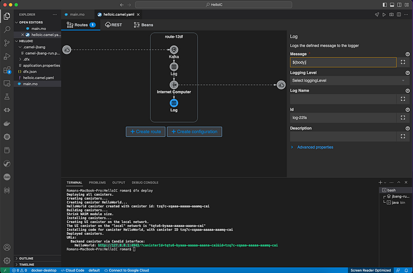

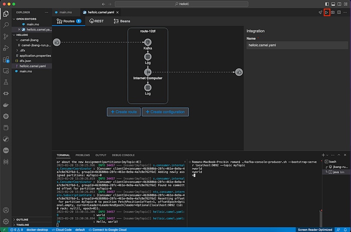

## IC4J Camel Component and Karavan Version

This repository currently uses the IC4J Camel component `0.8.2` and Apache Karavan `4.18.1`.

To install the IC4J Camel component into the Apache Karavan Visual Studio Code plug-in used here, add the `ic` item to:

`.vscode/extensions/camel-karavan.karavan-4.18.1/components/components.properties`

```properties
ic
```

Then add the content of [ic.json](https://github.com/ic4j/ic4j-camel/blob/master/src/ic.json) to:

`.vscode/extensions/camel-karavan.karavan-4.18.1/components/components.json`

To enable loading the IC4J libraries, move [application.properties](https://github.com/ic4j/ic4j-camel/blob/master/src/application.properties) to the root of your project.
